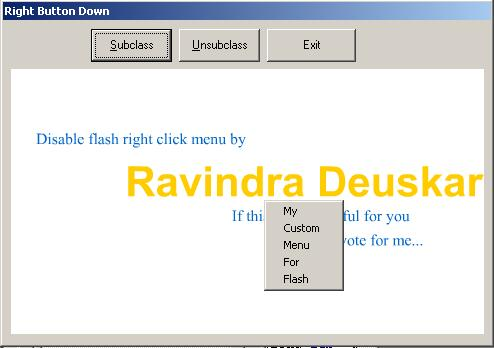



## Custom/Replace Macromedia Flash right click menu in VB

### Description

Disable right click menu of flash acivex control.

Replace it with your custom menu.
 
### More Info
 

             |
---                |---
**Submitted On**   |2002-07-04 19:48:28
**By**             |[Ravindra Deuskar](https://github.com/Planet-Source-Code/PSCIndex/blob/master/ByAuthor/ravindra-deuskar.md)
**Level**          |Advanced
**User Rating**    |5.0 (134 globes from 27 users)
**Compatibility**  |VB 6\.0
**Category**       |[Miscellaneous](https://github.com/Planet-Source-Code/PSCIndex/blob/master/ByCategory/miscellaneous__1-1.md)
**World**          |[Visual Basic](https://github.com/Planet-Source-Code/PSCIndex/blob/master/ByWorld/visual-basic.md)
**Archive File**   |[Custom\_Rep101820742002\.zip](https://github.com/Planet-Source-Code/ravindra-deuskar-custom-replace-macromedia-flash-right-click-menu-in-vb__1-36308/archive/master.zip)

